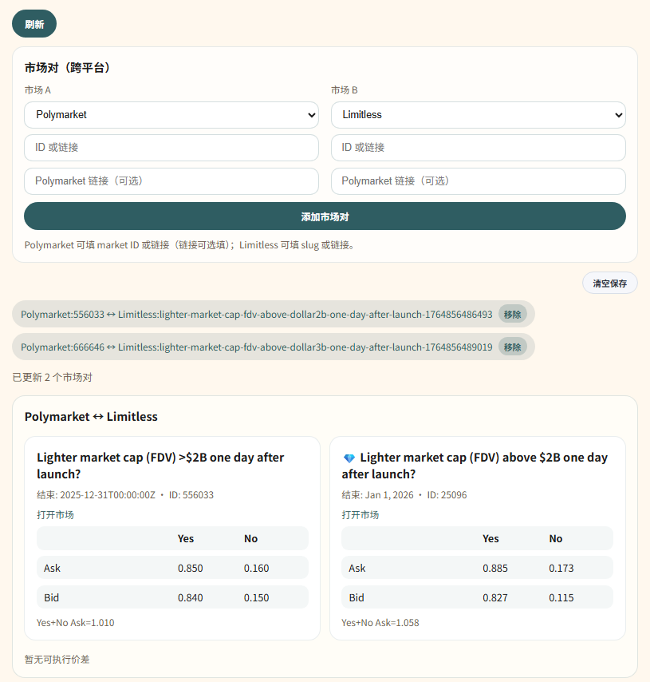

# 预测市场对冲监控平台

这是一个用于监控预测市场对冲与套利机会的轻量平台。目标是允许配置市场对，实时观察价格差异，并提示可执行的套利窗口。


## 功能范围
- 配置与维护市场对
- 监控价格与价差
- 识别套利机会并提示
- V1 由人工执行套利交易

## 规划中的能力
- 自动化交易执行（后续版本）
- 风控与执行策略配置

## 技术约束
- 前端 Node
- 后端 Python3


## 项目结构
- `backend/`：Python 服务，负责拉取市场数据并提供 API
- `backend/providers/`：数据提供方适配
  - `polymarket`：通过 Gamma API 拉取市场信息，并可选从 CLOB 获取盘口（需要 `py_clob_client`）
  - `limitless`：通过公开接口按 market slug 查询
- `frontend/`：Node.js 静态服务，提供可视化监控界面

## 后端说明
核心服务基于 FastAPI，主要路由在 `backend/app.py`，并通过 `provider` 参数切换数据源：
- Polymarket: `/api/markets?ids=123,456&provider=polymarket`
- Limitless: `/api/markets?ids=will-be-listed-on-binance-spot-in-2025-1760872411523&provider=limitless`

当 `py_clob_client` 可用时，Polymarket 会尝试拉取订单簿最佳价并补充到 `outcomeBids/outcomeAsks` 字段。

## 运行方式

后端（支持热更新）：
```bash
python3 -m pip install -r backend/requirements.txt
python3 -m uvicorn backend.app:app --reload --port 8000
```

前端：
```bash
cd frontend
npm install
npm run start
```

浏览器访问：`http://localhost:3000`

## 依赖
后端依赖已整理到 `backend/requirements.txt`：
- fastapi
- uvicorn
- py_clob_client

## 备注
当前版本以最小可用为目标，优先完成监控与提示流程。
